# GPX Administrative Web App

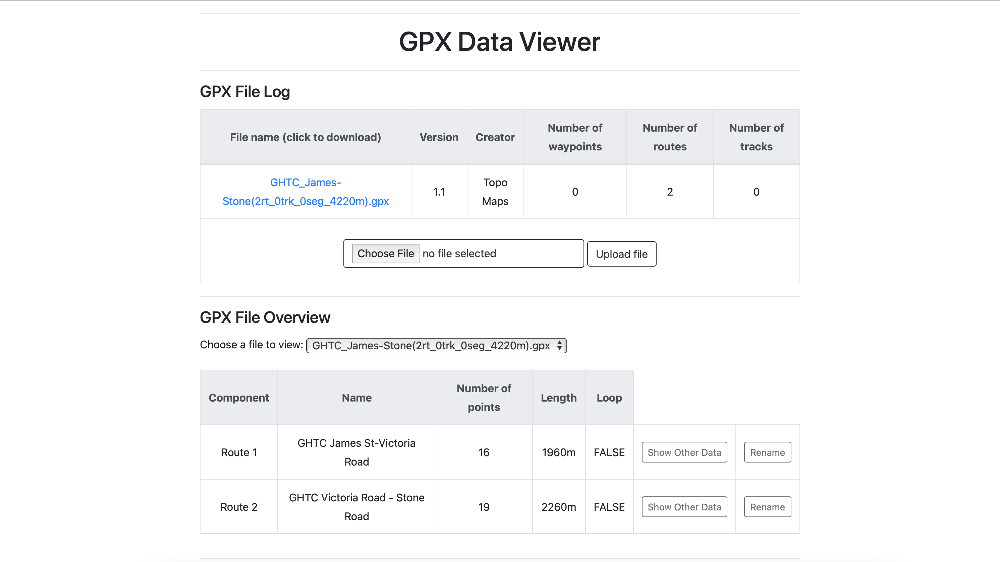
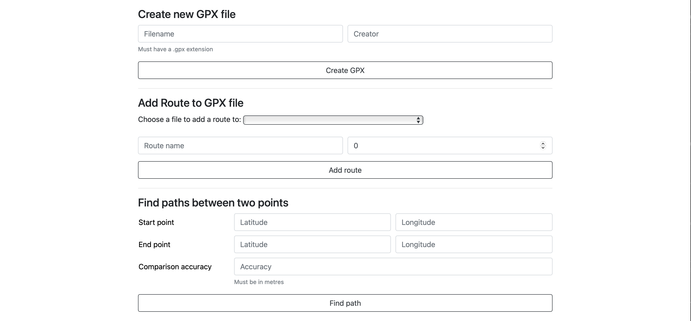
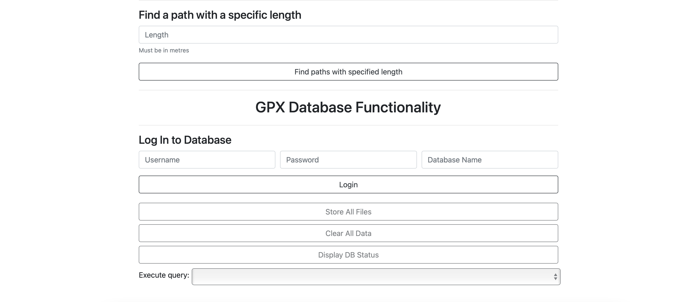

---

## Main Functionality

- Links in the _File Log_ panel can be clicked to download the file
- Once a file is uploaded/created/modified the page is automatically refreshed or the _File Log_ panel is updated accordingly
- If a specific route/track is renamed the _File Overview_ panel is also updated accordingly

---

### Viewing other data of a route or track

Click the `Show Other Data` button in the _File Overview_ panel to view other data of a specific route/track
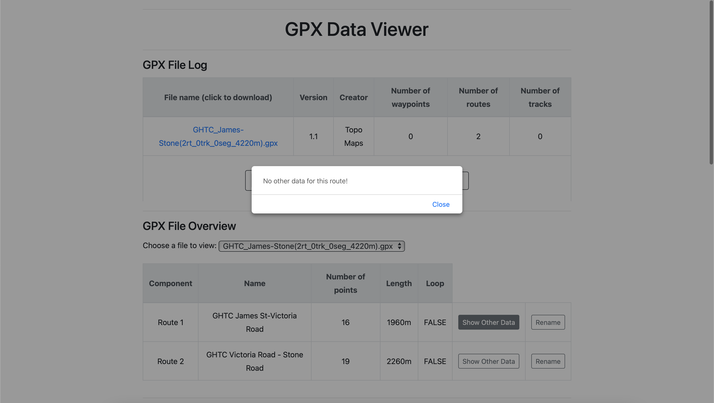

---

### Renaming a route or track

Click the `Rename` button in the _File Overview_ panel to rename a specific route/track
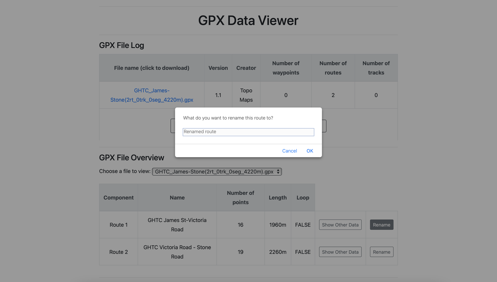
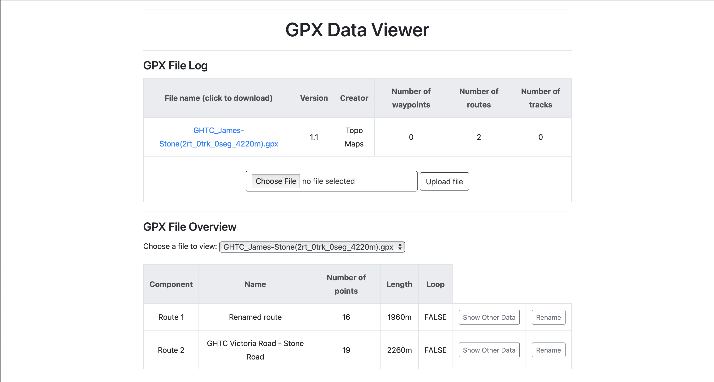

---

### Creating a new GPX file

Fill out the required fields in the _Create new GPX file_ section, and then click `Create GPX`
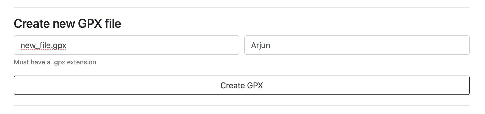
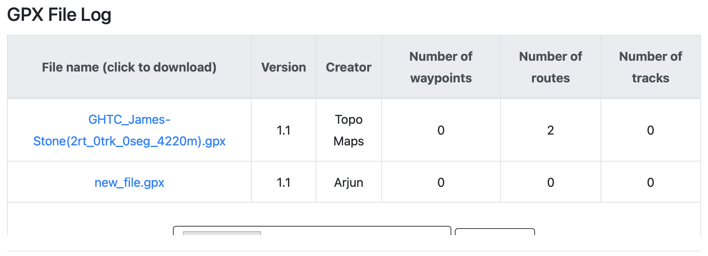

---

### Adding a route to a GPX file

Fill out any fields that you wish to change in the _Add Route to GPX file_ section (name can be left blank and a route can have no waypoints), and then click `Add route`
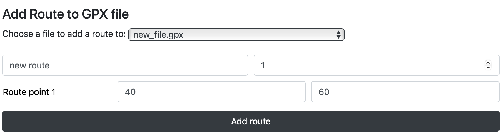
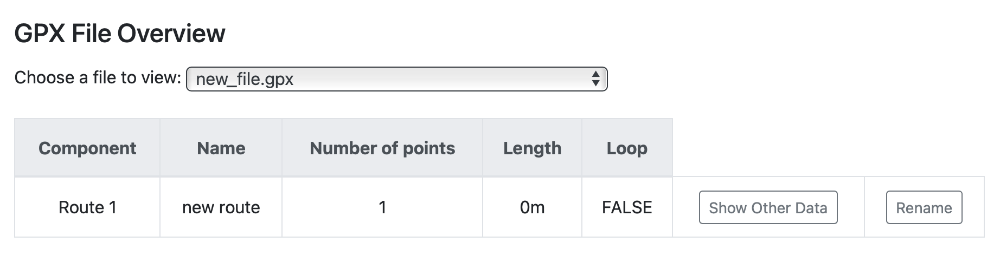

---

### Finding all paths between two points

Fill out the required fields in the _Find paths between two points_ section, and then click `Find path`
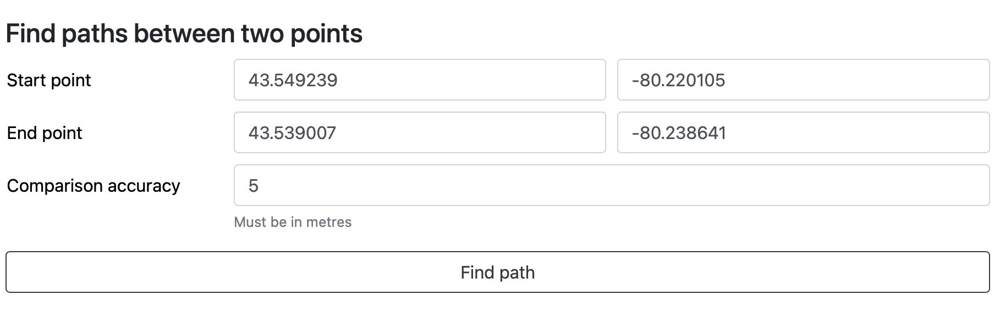
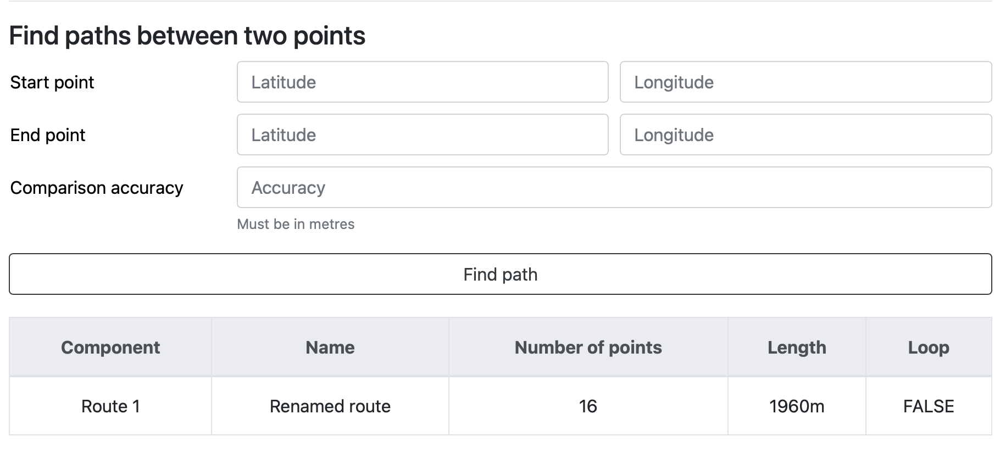

---

### Finding the number of paths with a specific length

Fill out the required fields in the _Find a path with a specific length_, and then click `Find paths with specified length`
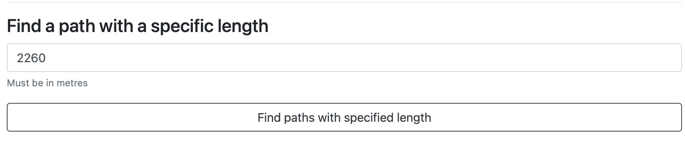
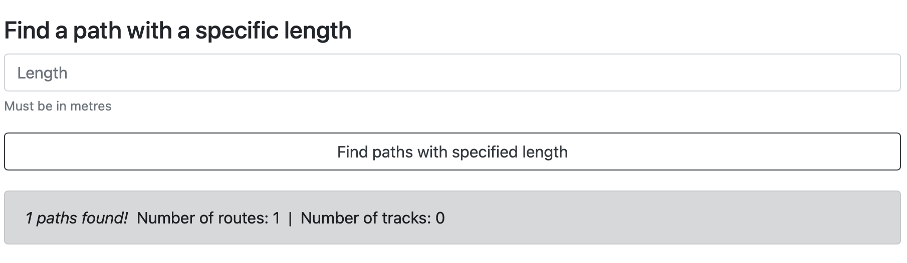

---

## Database Functionality

- All the buttons in this section will only become active if it makes sense for them to be e.g. if there are no files on the database, the `Clear All Data` button will stay disabled
- After each button is clicked, the database status is displayed, and can also be shown by clicking the `Display Status` button

---

### Logging into the database

Fill out the required fields in the _Log In to Database_ section, and then click `Login`

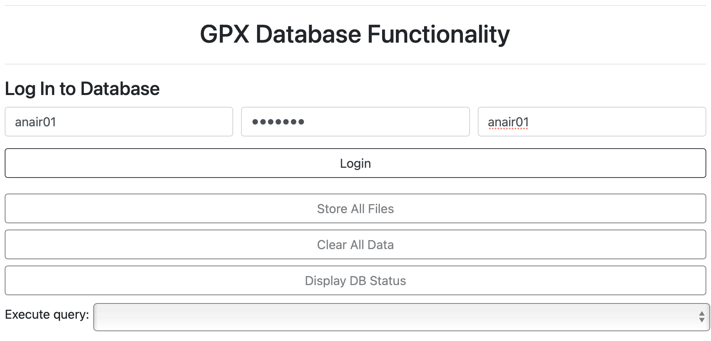
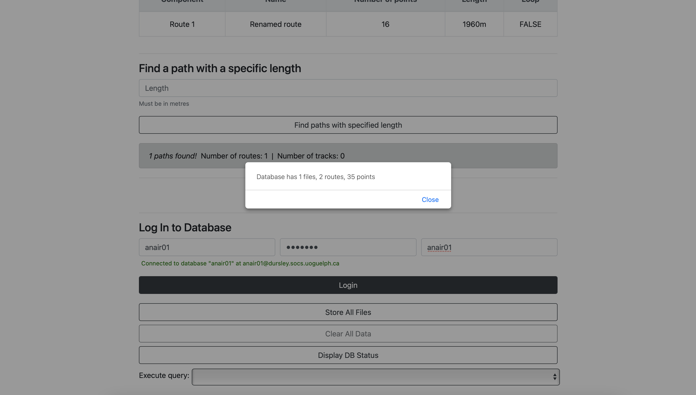

---

### Store files currently on the server to the database

Click the `Store All Files` button which will only be active if there are any files in the _uploads_ directory

---

### Clear all records from all tables in the database

Click the `Clear All Data` button which will only be active if the database has any records

---

### Execute query

5 queries that can be run on the database, to get a table of results back. Results can be sorted depending on the query

- Display all routes
- Display all routes from specific file
- Display all points from a route
- Display all points from specific file
- Display shortest/longest routes from specific file
